# Nocturnix Repair Platform Architecture

Last updated: 2026-07-22
Status: Living architectural reference
Scope: Current Python source, including active, legacy, placeholder, and planned code

## Architecture Version

- Architecture document version: 1.0
- Application version represented: 0.7.0 alpha
- Architecture state: stabilization
- System of record: `Data/Nocturnix_Master_Database.xlsm`
- Official entry point: `Source/run_gui.py`

Increment the architecture document version when dependency direction, composition
ownership, persistence strategy, or layer responsibilities change materially.

## Architecture Principles

1. **Single composition root.** `Application` owns construction of the active
   manager graph and the loaded database dictionary.
2. **Directed dependencies.** Presentation should call GUI adapters, services should
   apply business rules, and repositories should provide data access.
3. **Workflow ownership.** Multi-step processes, process state, and transitions
   belong in workflows rather than services or GUI classes.
4. **Repository consistency.** Collections return `pandas.DataFrame`, single records
   return `pandas.Series | None`, and repositories do not construct domain models by
   default.
5. **Explicit ownership.** Managers wire and own dependencies; they should not absorb
   business rules or presentation behavior.
6. **Replaceable persistence boundary.** Excel is the current system of record, but
   GUI and business rules should not depend directly on openpyxl or workbook layout.
7. **Current versus target accuracy.** Planned components and empty placeholders must
   remain visibly distinct from active runtime dependencies.

## Current Architecture

### Startup path

```text
Source/run_gui.py
  -> gui.app.main_window.main
  -> MainWindow
  -> Application (composition root)
```

`Source/run_gui.py` is the official GUI entry point.

`Source/main.py` is a separate legacy console path. It performs workbook and
relationship validation, constructs `Application`, and starts
`ApplicationController`, which depends on `legacy_ui`. It is not the official GUI
entry point.

### Architecture at a glance

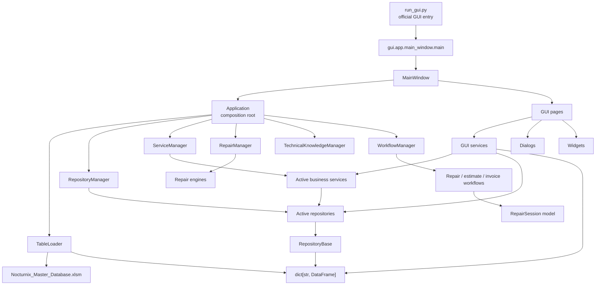

Arrows mean "imports, constructs, calls, or reads from." Several runtime
dependencies are injected through `Application` and therefore do not appear as
direct Python imports.

### Current layer dependency graph

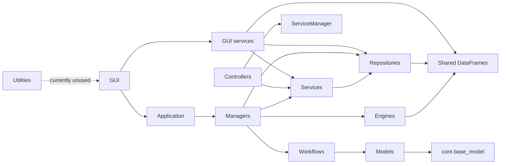

The intended direction is GUI -> service -> repository -> persistence. The current
implementation has deliberate and accidental shortcuts: GUI services can access
repositories and raw DataFrames, while repair engines read the shared database
dictionary directly.

### End-to-end request flow

This diagram shows the normal current read/query path from a user action to the Excel
data loaded in memory and back to the GUI. Dashed edges identify current shortcuts.

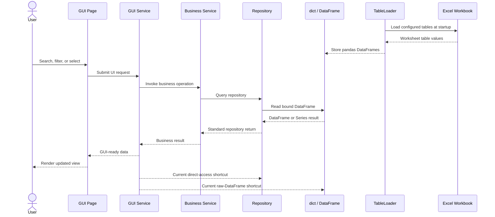

### Composition and ownership

`Source/app.py::Application` owns the active object graph:

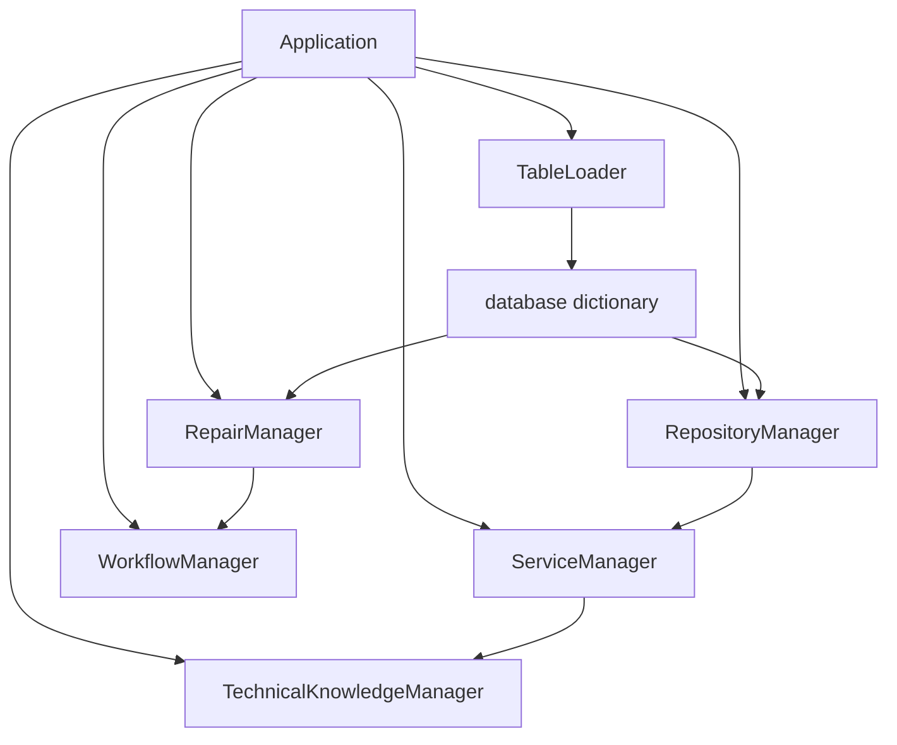

`TableLoader` currently lives in `services/` even though it performs workbook I/O.
Architecturally it is an infrastructure/data component.

Ownership responsibilities are:

| Component | Ownership responsibility |
|---|---|
| `Application` | Composition root. Loads the database and owns the top-level manager instances for the application lifetime. |
| `RepositoryManager` | Owns the active repository instances that share the loaded database dictionary. |
| `ServiceManager` | Owns the active business-service instances and injects repositories into them. |
| `RepairManager` | Owns the repair-domain engine instances for quoting, pricing, inventory, and compatibility. |
| `WorkflowManager` | Owns multi-step repair, estimate, and invoice workflow instances and injects `RepairManager` into them. |

Managers establish object ownership and dependency wiring. They should not absorb
business rules that belong in services or multi-step process state that belongs in
workflows.

### Managers

#### Active manager graph

```mermaid
flowchart TD
    RepositoryManager --> CustomerRepository
    RepositoryManager --> CustomerDeviceRepository
    RepositoryManager --> DeviceRepository
    RepositoryManager --> ManufacturerRepository
    RepositoryManager --> DeviceFamilyRepository
    RepositoryManager --> RepairRepository
    RepositoryManager --> GuideRepository

    ServiceManager --> RepositoryManager
    ServiceManager --> CustomerService
    ServiceManager --> CustomerDeviceService
    ServiceManager --> DeviceService
    ServiceManager --> RepairService
    ServiceManager --> TechnicalKnowledgeService

    TechnicalKnowledgeManager --> TechnicalKnowledgeService

    RepairManager --> QuoteEngine
    RepairManager --> PricingEngine
    RepairManager --> InventoryEngine
    RepairManager --> CompatibilityEngine

    WorkflowManager --> RepairManager
    WorkflowManager --> RepairWorkflow
    WorkflowManager --> EstimateWorkflow
    WorkflowManager --> InvoiceWorkflow
```

#### Supporting, inactive, or incomplete managers

| Manager | Dependency | Current role |
|---|---|---|
| `WorkbookManager` | openpyxl | Full workbook open/save/close abstraction; not wired into `Application`. |
| `WorksheetManager` | `WorkbookManager` | Worksheet CRUD helper; not wired into startup. |
| `TableManager` | `WorkbookManager`, `WorksheetManager`, openpyxl | Detailed Excel-table access and mutation; not wired into startup. |
| `SeederManager` | `CustomerSeeder`, `RepairSeeder` | Uses an obsolete seeder API and is not wired into startup. |
| `CatalogManager` | `CatalogGenerator` | Export facade with placeholder methods. |
| `InventoryManager` | injected services | Placeholder coordination methods. |
| `ApplicationManager` | none | Empty bootstrap/shutdown scaffold. |
| `ControllerManager` | none | Attribute container with no constructed controllers. |
| `workbook_save_engine.py` | none | Empty placeholder. |

There is also a second `SeederManager` under `Source/seeders/`, which is the one
used by `Source/scripts/run_seeders.py`.

`Source/managers/` contains the currently preferred `WorkbookManager`,
`WorksheetManager`, and `TableManager` implementation. The overlapping
`Source/data/workbook_manager.py` and `Source/data/table_manager.py` implementations
are duplicates pending controlled retirement. They should not be deleted until
references, behavior, and migration impact have been verified.

### Services

Services contain business rules, validation, calculations, and coordination of
repository operations. Multi-step processes, process state, and transitions belong
in `Source/workflow/`, not in services.

```mermaid
flowchart TD
    CustomerService --> BaseService
    CustomerService --> CustomerRepository
    CustomerEditor --> CustomerRepository
    CustomerDeviceService --> CustomerDeviceRepository

    DeviceService --> BaseService
    DeviceService --> DeviceRepository
    DeviceService --> ManufacturerRepository
    DeviceService --> DeviceFamilyRepository
    DeviceService --> GuideRepository

    RepairService --> BaseService
    RepairService --> RepairRepository
    TechnicalKnowledgeService --> GuideRepository
    SupplierService --> BaseService
    SupplierService --> SupplierRepository

    GuideService --> BaseService
    DocumentService --> BaseService
    LaborService --> BaseService
    ToolService --> BaseService
    TrainingService --> BaseService

    TableLoader --> OpenPyXL
    TableLoader --> Pandas
    TableLoader --> DatabaseConfig["config.database.TABLES"]
    CatalogGenerator --> Database["database dictionary"]
```

`CustomerService`, `CustomerDeviceService`, `DeviceService`, `RepairService`, and
`TechnicalKnowledgeService` are constructed by `ServiceManager`. Supplier, guide,
document, labor, tool, and training services exist but are not part of the active
composition root.

`TechnicalKnowledgeService` currently calls `GuideRepository.all_guides()`, but the
repository exposes `all()`. This is a known broken dependency contract.

### Repositories

All nonempty concrete repositories inherit `RepositoryBase`. The base stores a
reference to the shared database dictionary and binds one DataFrame by key.

#### Repository return standard

- Collection queries return `pandas.DataFrame`.
- Single-record queries return `pandas.Series | None`.
- Repositories do not construct domain models by default.

Domain-model construction, when needed, belongs in a service, workflow, or explicit
mapping layer. Repository methods should return copies where mutation by callers
would otherwise alter repository state unintentionally.

```mermaid
flowchart TD
    RepositoryBase --> Pandas
    RepositoryBase --> Database["dict[str, DataFrame]"]

    CustomerRepository --> RepositoryBase
    CustomerDeviceRepository --> RepositoryBase
    DeviceRepository --> RepositoryBase
    ManufacturerRepository --> RepositoryBase
    DeviceFamilyRepository --> RepositoryBase
    RepairRepository --> RepositoryBase
    GuideRepository --> RepositoryBase

    CompatibilityRepository --> RepositoryBase
    InventoryRepository --> RepositoryBase
    LaborRepository --> RepositoryBase
    ServiceRepository --> RepositoryBase
    SupplierRepository --> RepositoryBase
    GuideCategoryRepository --> RepositoryBase
    GuideSourceRepository --> RepositoryBase
    CommonFailureRepository --> RepositoryBase
    QualityChecklistRepository --> RepositoryBase
    RepairNoteRepository --> RepositoryBase
    RepairPartRepository --> RepositoryBase
    RepairToolRepository --> RepositoryBase
    TechnicalDocumentRepository --> RepositoryBase
    TechnicalLibraryRepository --> RepositoryBase
    ToolRepository --> RepositoryBase
    TrainingVideoRepository --> RepositoryBase
```

#### Repository-to-table bindings

| Repository | Database key | Active in `RepositoryManager` |
|---|---|---:|
| `CustomerRepository` | `customers` | Yes |
| `CustomerDeviceRepository` | `customer_devices` | Yes |
| `DeviceRepository` | `master_devices` | Yes |
| `ManufacturerRepository` | `manufacturer_catalog` | Yes |
| `DeviceFamilyRepository` | `device_catalog` | Yes |
| `RepairRepository` | `repair_tickets` | Yes |
| `GuideRepository` | `repair_guides` | Yes |
| `CompatibilityRepository` | `compatibility` | No |
| `InventoryRepository` | `parts_catalog` | No |
| `LaborRepository` | `labor_rates` | No |
| `ServiceRepository` | `master_services` | No |
| `SupplierRepository` | `supplier_catalog` | No |
| `GuideCategoryRepository` | `guide_categories` | No |
| `GuideSourceRepository` | `guide_sources` | No |
| `TechnicalLibraryRepository` | `technical_library` | No |
| `CommonFailureRepository` | `common_failures` | No; key is not configured by `TABLES`. |
| `QualityChecklistRepository` | `quality_checklists` | No; key is not configured. |
| `RepairNoteRepository` | `repair_notes` | No; key is not configured. |
| `RepairPartRepository` | `repair_parts` | No; key is not configured. |
| `RepairToolRepository` | `repair_tools` | No; key is not configured. |
| `TechnicalDocumentRepository` | `technical_documents` | No; key is not configured. |
| `ToolRepository` | `tool_catalog` | No; key is not configured. |
| `TrainingVideoRepository` | `training_videos` | No; key is not configured. |

`repositories/__init__.py` is empty. Concrete repositories are imported from their
individual modules.

### Engines

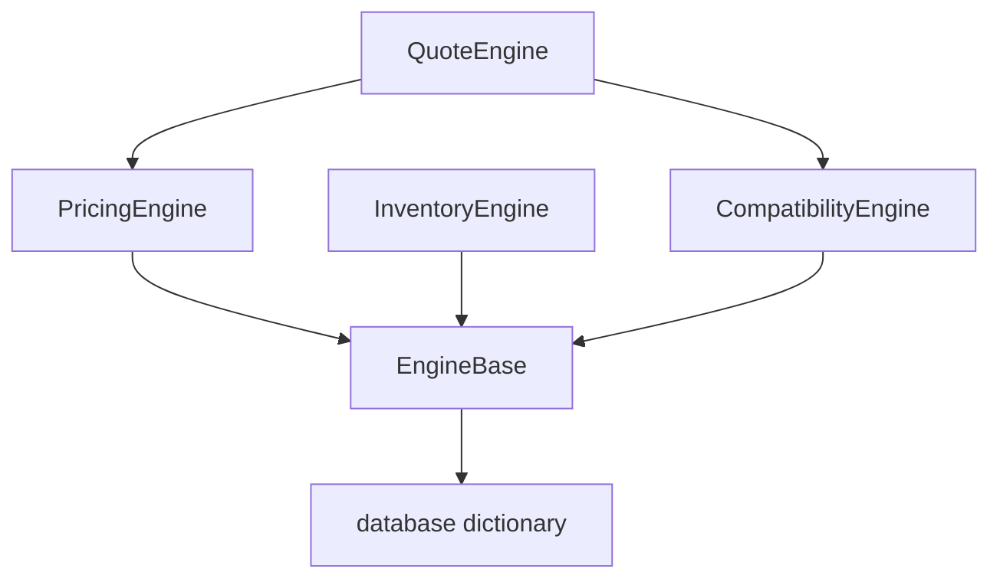

`RepairManager` constructs all four concrete engines. `QuoteEngine` constructs its
own compatibility and pricing engines, so those engine instances are duplicated
inside the repair subsystem. Engines bypass repositories and query DataFrames from
the shared database dictionary through `EngineBase`.

### Controllers

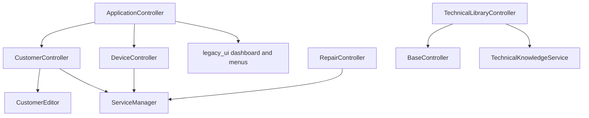

Controllers belong primarily to the legacy console path described under Startup
path. The official PySide6 GUI uses GUI services instead. `controllers/__init__.py`
is empty, several controller paths are incomplete, and `ApplicationController`
depends directly on `legacy_ui`.

### GUI

#### Active GUI graph

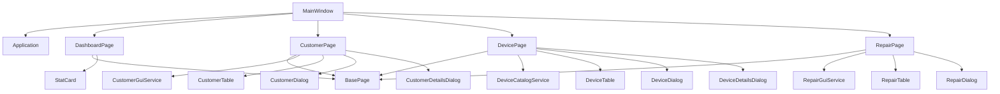

#### GUI-service runtime graph

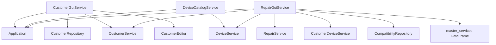

`RepairGuiService` expects `application.repositories.compatibility`, but
`RepositoryManager` does not currently construct that repository. This dependency
fails when that path is exercised.

#### GUI inventory

- Active nonempty pages: base, dashboard, customer, device, and repair.
- Active nonempty dialogs: customer, customer details, device, device details, and
  repair.
- Active nonempty widgets: customer table, device table, repair table, and stat card.
- GUI services: customer, device catalog, and repair.
- 46 of 64 GUI Python files are empty placeholders, including most planned pages,
  dialogs, widgets, GUI managers, themes, and app helpers.

### Models

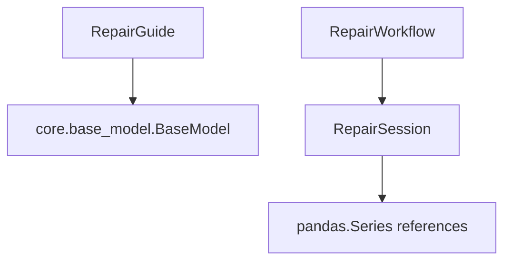

Most implemented model classes are independent data containers and currently have
no imports or active consumers. `RepairGuide` is the only model inheriting
`BaseModel`. `RepairSession` is a dataclass used by `RepairWorkflow` to hold customer,
device, service, compatibility, guide, labor, pricing, parts, and ticket state.

Model files present include customer, device, manufacturer, service, supplier,
inventory, invoice, payment, repair ticket/quote/session/guide, diagnostic,
compatibility, and related repair entities. Sixteen of 32 model Python files are
empty placeholders.

### Utilities

`Source/utilities/display_formatter.py`, `helpers.py`, `logger.py`, and `utils.py` are
all empty. No active source module imports the `utilities` package.

A separate nonempty logging implementation exists under `Source/logs/`, but
`application_log.py` and `error_log.py` import the nonexistent
`logging_system.logger` path rather than `logs.logger`.

### External dependencies

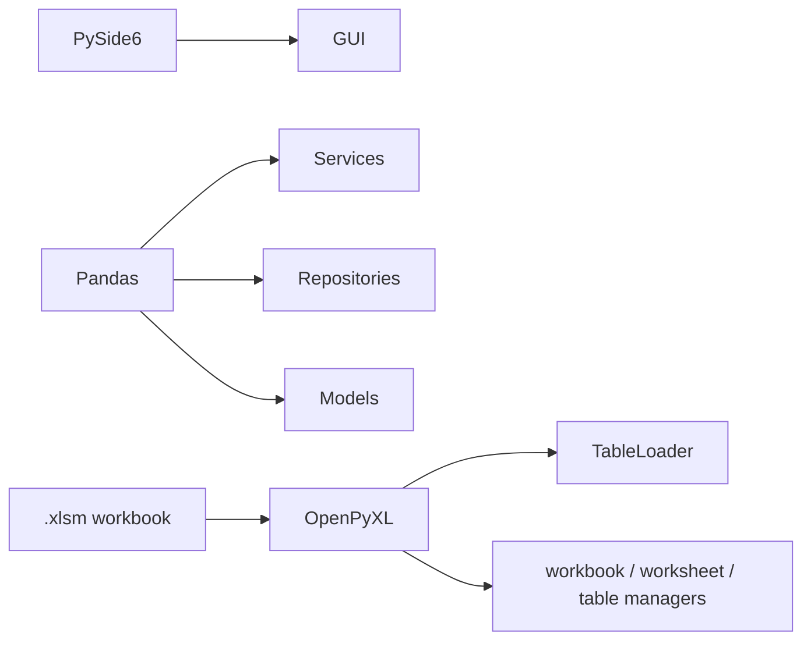

Runtime dependencies are declared in `pyproject.toml`: PySide6, pandas, and
openpyxl. Ruff, Pyright, and pytest are development dependencies.

## Target Architecture

The target keeps the current presentation, service, repository, workflow, and domain
concepts while introducing an explicit persistence transaction boundary. It is a
planned direction, not the current implementation.

### Planned unit-of-work architecture

The following existing diagram describes the planned target architecture:

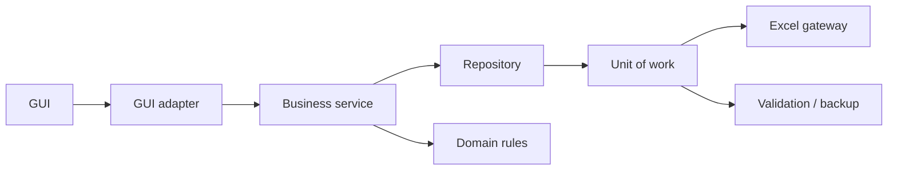

Target-state goals:

- GUI code reaches persistence only through adapters, services, and repositories.
- Services retain business rules; workflows own multi-step process state.
- A unit of work coordinates validation, backup, write, commit, and rollback.
- The Excel gateway becomes replaceable without rewriting GUI or business services.
- Direct GUI-service access to repositories and raw DataFrames is retired.

## Architectural findings

1. The official GUI path and legacy console path coexist; only `run_gui.py` is the
   official entry point.
2. `Application` is the active dependency container, while `ApplicationManager` is
   an unused scaffold.
3. The active repository and service managers expose only a subset of implemented
   repository/service classes.
4. GUI services sometimes bypass business services and read repositories or raw
   DataFrames directly.
5. Repair engines bypass repositories and duplicate engine instances inside
   `QuoteEngine` and `RepairManager`.
6. Workbook loading is active; durable write/save integration is not.
7. Duplicate manager, seeder, logger, and documentation implementations obscure the
   intended canonical path.
8. Empty placeholder files substantially overstate the apparent module surface.
9. Several declared runtime dependencies are broken or stale, notably compatibility
   access in `RepairGuiService`, `all_guides()` in `TechnicalKnowledgeService`, and
   `logging_system` imports.

## Maintenance rule

Update this document whenever an entry point, constructor dependency, manager
registration, repository table binding, service boundary, GUI composition, or
external dependency changes. Keep active dependencies distinct from placeholders and
planned architecture.
