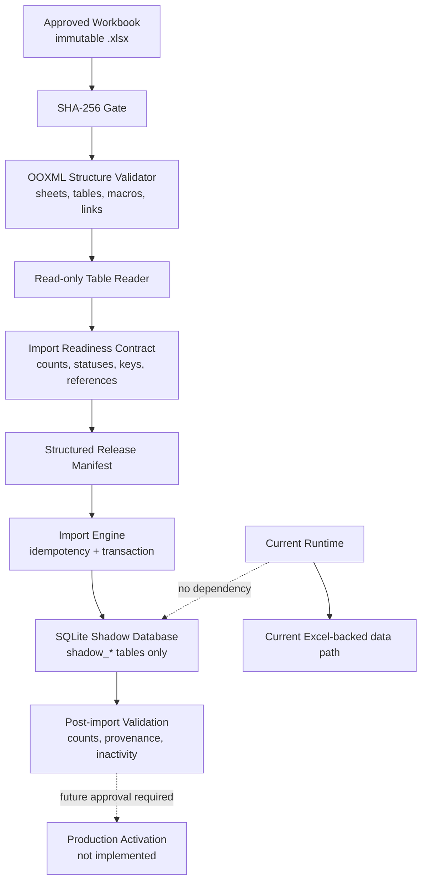
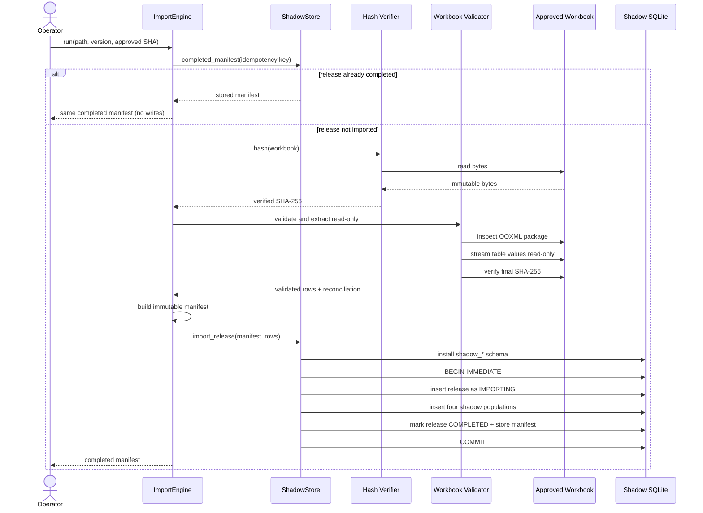
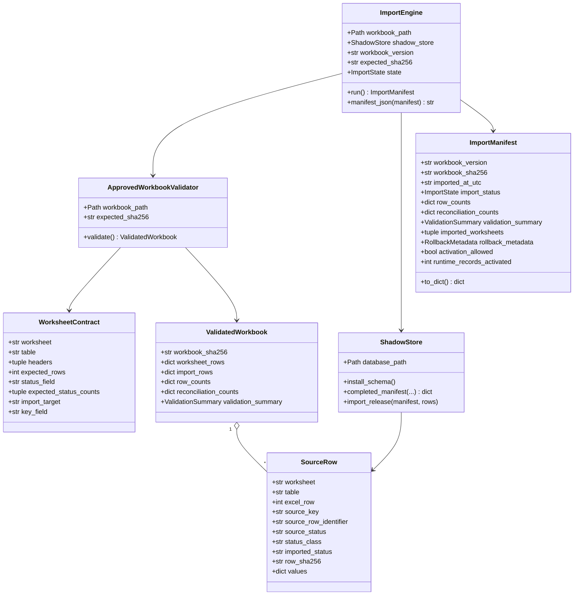
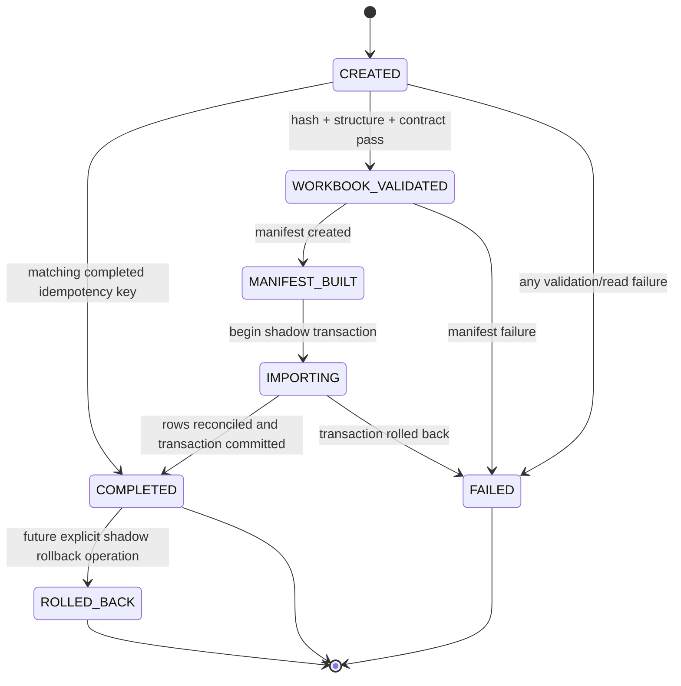

# Canonical Data Integration Architecture

Status: Phase 2 implemented for shadow import; production activation not implemented

Architecture version: 1.0

Date: 2026-07-23

Governing contract:
`Documentation/SERVICE_TYPE_IMPORT_READINESS_CONTRACT.md`

## Purpose

Phase 2 introduces a reusable boundary between approved Nocturnix workbook releases
and future canonical runtime data. Runtime components must not read approved release
workbooks directly. The Import Engine validates an immutable release and copies
eligible rows into an isolated shadow database for reconciliation and review.

This phase does not connect the shadow database to `Application`,
`config.database.TABLES`, repositories, pricing, compatibility, quote generation,
repair workflows, production workbooks, or production database reads.

## Implemented scope

| Component | Location | Responsibility |
| --- | --- | --- |
| Readiness contract | `Source/import_engine/contract.py` | Machine-readable v1.0 worksheet, table, header, count, status, and identity rules |
| Workbook validator | `Source/import_engine/workbook.py` | Verify hash and OOXML structure, stream values read-only, validate and reconcile |
| Manifest model | `Source/import_engine/manifest.py` | Typed import state, validation, rollback, and manifest records |
| Import Engine | `Source/import_engine/engine.py` | Orchestrate validation, manifest creation, idempotency, and atomic shadow import |
| Shadow store | `Source/import_engine/shadow_store.py` | Install namespaced SQLite shadow tables and atomically persist inactive rows |
| Tests | `Tests/test_import_engine.py` | Validate success, provenance, idempotency, failures, exclusion, and nonactivation |

The engine is reusable through constructor injection:

```python
engine = ImportEngine(
    workbook_path=approved_release_path,
    shadow_store=ShadowStore(shadow_database_path),
    workbook_version="v1.0",
    expected_sha256=approved_sha256,
)
manifest = engine.run()
```

There is intentionally no command-line entry point, scheduled job, startup hook, or
runtime composition registration in this phase.

## Architecture



### Trust boundaries

1. The caller supplies the workbook path, expected approved version, approved hash,
   and shadow database path.
2. SHA-256 is verified before parsing and again after reading.
3. OOXML package inspection rejects macros and external links and validates exact
   worksheet/table structure without saving the workbook.
4. `openpyxl` streams table values using `read_only=True`, `data_only=True`, and
   `keep_links=False`.
5. Contract validation completes before any shadow database is created.
6. All release and row inserts occur in one SQLite transaction.
7. SQLite constraints prohibit active/effective shadow records in this phase.
8. Existing runtime code has no import or configuration path to the shadow store.

## Sequence diagram



Any exception before commit produces `ImportEngineError`, transitions the in-memory
engine to `FAILED`, and leaves no completed or runtime-visible release.

## Class diagram



## Import state machine



The hash is also verified on an idempotent repeat before the stored manifest can be
returned. Production activation is deliberately absent from the state machine.

## Import Manifest schema

The manifest is emitted as a frozen Python record and can be rendered to stable JSON.

| Field | Type | Rule |
| --- | --- | --- |
| `manifest_schema_version` | string | Current value `1.0` |
| `contract_version` | string | Readiness contract implemented by the validator |
| `release_id` | UUID string | Deterministic from contract version, workbook version, and SHA |
| `workbook_path` | string | Resolved source path |
| `workbook_version` | string | Approved release version |
| `workbook_sha256` | string | Verified uppercase SHA-256 |
| `imported_at_utc` | ISO-8601 string | UTC import timestamp |
| `import_status` | enum | Completed manifest is `COMPLETED` |
| `row_counts` | object | Count for every governed worksheet |
| `reconciliation_counts` | object | Includes 314 source Services, 313 mappings, one exclusion, and zero activation |
| `validation_summary` | object | Result, passed/failed check counts, and messages |
| `imported_worksheets` | string array | The four shadow-imported governed worksheets |
| `rollback_metadata` | object | Strategy, deterministic token, and prior release reference |
| `activation_allowed` | boolean | Always false in Phase 2 |
| `runtime_records_activated` | integer | Always zero in Phase 2 |
| `manifest_metadata` | object | Import mode, idempotency key, and source read mode |

The idempotency key is:

```text
(contract_version, workbook_version, workbook_sha256)
```

A repeated completed release returns the stored manifest and performs no inserts.
A version/hash change creates a different release identity only after the contract is
updated to recognize that approved version.

## Shadow database

The engine installs only these namespaced tables in the caller-selected SQLite file:

- `shadow_import_releases`
- `shadow_canonical_service_types`
- `shadow_service_type_aliases`
- `shadow_service_normalization`
- `shadow_labor_normalization`

The four domain tables retain typed source fields plus a lossless JSON payload. Every
row includes:

- import release ID;
- source workbook;
- approved version;
- source SHA-256;
- source worksheet and table;
- deterministic source row identifier and Excel row number;
- imported timestamp;
- exact source review status and derived status class;
- imported status;
- effective date and superseded version;
- activation/runtime flags;
- source-row SHA-256;
- complete raw payload.

The schema enforces:

```text
imported_status = SHADOW_REFERENCE
activation_approved = 0
runtime_active = 0
```

No active view, production synonym, repository adapter, or runtime read API is
created.

## Contract validation

The validator requires:

- the approved workbook SHA-256;
- exact ten-sheet order and one exact Excel table per sheet;
- no VBA project or external links;
- exact headers and release row counts;
- exact source status vocabulary and v1.0 status distributions;
- valid, unique STY, STA, SVC, and LAB identities;
- paired and resolvable proposed STY ID/type references;
- zero Service-to-Labor candidates;
- `SVC000343` absent from Service Normalization and present exactly once in
  Unresolved Review with high priority and `Pending Evidence Review`;
- `314 = 313 + 1`;
- unchanged workbook SHA-256 after reading.

All failures are fail-closed and occur before shadow persistence.

## Failure and rollback model

Validation failure creates no shadow database. Persistence uses one transaction, so a
failed insert cannot expose a partial completed release.

Rollback metadata is present in the manifest, but an automated rollback command is
not exposed in Phase 2. A future shadow rollback must mark the immutable release
`ROLLED_BACK` and exclude it from reference views. It must not delete audit history or
touch production data. Production rollback belongs to a separately approved
activation phase.

## Production activation boundary

Phase 2 stops after shadow validation. Production activation requires:

1. approved row-level statuses;
2. a separately designed activation service;
3. active-view and conflict semantics;
4. effective-date and supersession governance;
5. runtime repository adapters;
6. dual-run and regression evidence;
7. feature gates and monitoring;
8. tested production rollback;
9. explicit approval under the Import Readiness Contract.

None of these capabilities is implied by successful shadow import.

## Test plan

### Automated tests implemented

| Test | Expected result |
| --- | --- |
| Exact contract workbook import | Four shadow tables receive 77, 17, 313, and 265 rows |
| Shadow-only isolation | No non-`shadow_*` tables exist in the test database |
| Provenance completeness | Sample row retains every required provenance field and raw payload |
| Nonactivation | Manifest and all rows report zero/false activation |
| Idempotent repeat | One release and unchanged row counts after a second run |
| SHA mismatch | Import fails before database creation |
| Unknown/case-variant status | Import fails before database creation |
| `SVC000343` in Service mappings | Import fails before database creation |
| Schema activation attempt | SQLite constraint rejects the write |

### Required verification before merging Phase 2

- Run focused Import Engine tests.
- Run Ruff across the new package and test.
- Run Pyright across the new package.
- Run the configured repository pytest suite.
- Run an integration import of the approved v1.0 workbook into a temporary database.
- Verify approved workbook hash before and after the integration test.
- Query every shadow table for counts, null provenance, nonzero runtime flags, and
  duplicate release/row identities.
- Confirm `git diff` contains no runtime repository, engine, pricing, compatibility,
  quote, repair workflow, database configuration, or production data changes.
- Retain no generated shadow database in the repository.

### Future activation test plan

Before activation code is permitted, add tests for exact `Approved` status gating,
canonical parent dependencies, conflict fail-closed behavior, effective dates,
supersession, feature-gate isolation, dual-run parity, monitoring, and rollback.
