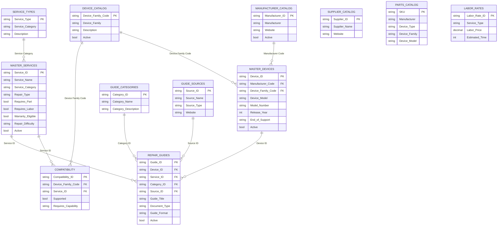
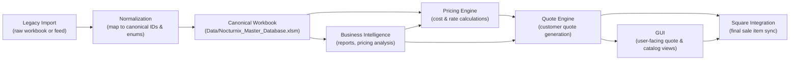

# Master Catalog Architecture

Last updated: 2026-07-22
Status: Phase 1D canonical master catalog design
Scope: Documentation only; no workbook or workbook data is modified.

## 1. Canonical tables

The current canonical master catalog is centered on the workbook tables loaded by `Source/config/database.py` and validated by `Source/validators/workbook_validator.py`.

- `manufacturer_catalog` / `tblManufacturerCatalog`
- `device_catalog` / `tblDeviceCatalog`
- `master_devices` / `tblMasterDevices`
- `service_types` / `tblServiceTypes`
- `master_services` / `tblMasterServices`
- `compatibility` / `tblCompatibilityID`
- `guide_categories` / `tblGuideCategories`
- `guide_sources` / `tblGuideSources`
- `repair_guides` / `tblRepairGuides`
- `technical_library` / `tblTechnicalLibrary`
- `parts_catalog` / `tblPartsCatalog`
- `supplier_catalog` / `tblSupplierCatalog`
- `labor_rates` / `tblLaborRates`
- `parts_pricing` / `tblParts`
- `retail_pricing` / `tblRetailPricing`
- `profit_margin` / `tblProfitMargin`

### Planned canonical tables

These are proposed or referenced by the engine and architecture plans but are not configured in `config.database.TABLES` yet.

- `inventory_items`
- `pricing_rules`
- `quote_records`
- `diagnostics` (future canonical diagnostic records)

## 2. Primary keys

Primary key candidates derived from current workbook schema and documented observations:

- `manufacturer_catalog`: `Manufacturer ID`
- `device_catalog`: `Device Family Code`
- `master_devices`: `Device ID`
- `service_types`: `Service Type` (proposed; current workbook lacks stable PK)
- `master_services`: `Service ID`
- `compatibility`: `Compatibility ID`
- `guide_categories`: `Category ID`
- `guide_sources`: `Source ID`
- `repair_guides`: `Guide ID`
- `technical_library`: `Technical ID` (proposed)
- `parts_catalog`: `SKU` (proposed placeholder)
- `supplier_catalog`: `Supplier ID` (proposed)
- `labor_rates`: `Labor Rate ID` or `Service Type` as a lookup key
- `parts_pricing`: `SKU` or generated price record ID (proposed)
- `retail_pricing`: `Pricing Record ID` (proposed)
- `profit_margin`: `Profit Margin ID` (proposed)

The current data indicates `Service Type` in `service_types` and `Service Name` in `compatibility` are temporary labels rather than durable canonical keys.

## 3. Foreign keys

Inferred foreign key relationships from names and documented schema contracts:

- `master_devices.Manufacturer Code` -> `manufacturer_catalog.Manufacturer ID`
- `master_devices.Device Family Code` -> `device_catalog.Device Family Code`
- `compatibility.Device Family` -> `device_catalog.Device Family Code` (mislabeled child field)
- `compatibility.Service Name` -> `master_services.Service ID` (current values are service IDs)
- `repair_guides.Device ID` -> `master_devices.Device ID`
- `repair_guides.Service ID` -> `master_services.Service ID`

Additional planned foreign keys:

- `master_services.Service Category` -> `service_types.Service Type`
- `labor_rates.Service Type` -> `master_services.Service ID`
- `parts_pricing.SKU` -> `parts_catalog.SKU`
- `parts_pricing.Manufacturer` -> `manufacturer_catalog.Manufacturer ID`
- `supplier_catalog.Supplier ID` -> supplier relationship fields in planned pricing/inventory tables

## 4. Relationships

### Core master catalog relationships

- `manufacturer_catalog` provides manufacturers for `master_devices`.
- `device_catalog` provides device family taxonomy for `master_devices` and `compatibility`.
- `master_devices` is the canonical device model catalog used by repair guides and device-level workflows.
- `master_services` is the canonical service catalog used by compatibility, repair guides, and pricing.
- `compatibility` links device families to supported services and records whether they are supported.
- `repair_guides` links devices and services to technical guidance.

### Pricing and labor relationships

- `labor_rates` should be a rate table that maps to service definitions.
- `parts_pricing` and `profit_margin` are legacy pricing artifacts; they should be refactored into canonical `pricing_rules`, `inventory_items`, and `quote_records`.
- `retail_pricing` is currently an output-style table and should not be treated as a stable input source.

### Knowledge and reference relationships

- `guide_categories` and `guide_sources` are lookup classifications for technical content.
- `technical_library` is a placeholder for a broader knowledge repository; its current workbook rows are mostly empty and denormalized.
- `supplier_catalog` is a supplier lookup that should be normalized before it is used in purchasing or cost relationships.

## 5. Lookup tables

Current lookup tables:

- `manufacturer_catalog`
- `device_catalog`
- `service_types`
- `guide_categories`
- `guide_sources`
- `supplier_catalog`

Legacy or reference lookup-like tables:

- `labor_rates` (service/labor pricing lookup)
- `parts_catalog` (catalog/pricing export table, not inventory)
- `profit_margin` (legacy margin example table)
- `retail_pricing` (legacy retail output table)

## 6. Enumerations

Several enumerations are documented in the labor catalog design and should be modeled explicitly or via lookup tables:

- Device categories
- Manufacturers
- Services
- Repair difficulty levels
- Skill levels
- Yes/No flags
- Labor rate tiers
- Warranty options
- Status values (`Active`, `Planned`, `Future`, `Draft`)
- Confidence values (`High`, `Medium`, `Low`)
- Source types (`Internal Estimate`, `Historical Average`, `Vendor Guidance`, `Manufacturer Estimate`, `Market Research`)

These values appear in the labor standards artifact and are candidates for canonical lookup tables or strict enumeration constraints in the master catalog.

## 7. Data ownership

Canonical data ownership should be assigned by domain and by artifact:

- Device taxonomy: product/catalog owner
- Manufacturer data: procurement or sourcing owner
- Service taxonomy and repair definitions: operations/repair engineering owner
- Labor standards: operations and labor planning owner
- Compatibility rules: repair engineering owner
- Pricing rules and margins: pricing governance owner
- Supplier and part metadata: procurement owner
- Technical guides and sources: knowledge management owner
- Workbook schema and access: data engineering or platform owner

Ownership responsibilities:

- Data owners define canonical fields, required values, and enumeration semantics.
- Workbook owners manage the physical Excel workbook schema, backup cadence, and workbook-level validation.
- Engineering owners implement adapters, validation logic, and safe migration paths.

## 8. Workbook ownership

The current system of record is the workbook `Data/Nocturnix_Master_Database.xlsm`.

Key workbook ownership points:

- `Source/config/database.py` defines the workbook path and configured loaded tables.
- `Source/services/table_loader.py` and `Source/validators/workbook_validator.py` are the current workbook-loading and validation boundaries.
- `Source/Data/Nocturnix_Master_Database.xlsm` is treated as the active workbook; `Data/Nocturnix_Development.xlsm` and `Data/Old Versions/` are development and archive copies.
- The script `Scripts/generate_nocturnix_labor_catalog.py` references an external labor catalog source file path and generates a labor catalog workbook, but this source file is not part of the repository.

Workbook ownership policy:

- Do not perform in-place schema migration on the active workbook without a backup.
- Preserve workbook column names until adapters and schema migration steps are explicitly approved.
- Keep current workbook access read-only for analysis until durable persistence is implemented safely.

## 9. Import workflow

The import workflow should be treated as a staging and validation pipeline rather than a direct workbook edit.

### Recommended import flow

1. Source the raw import artifact into a staging workspace. The raw import artifact may be a workbook such as `Raw Import Data.xlsx` or another import table.
2. Validate the raw import schema against the canonical staging schema.
3. Normalize raw values to canonical lookup IDs and enumerations.
4. Run referential integrity checks for manufacturers, device families, services, and supplier references.
5. Load normalized records into the canonical workbook tables or an intermediate import staging table.
6. Record the import source, timestamp, data owner, and any transformation notes.

### Current implementation notes

- `TableLoader` currently loads configured workbook tables into pandas DataFrames on startup.
- `WorkbookValidator` validates the required table names exist in the workbook, but not all content rules.
- There is no currently active workbook import API for raw external data in the repository.

## 10. Update workflow

Updates to canonical master catalog content must be controlled, validated, and versioned.

### Recommended update flow

1. Create a disposable workbook copy or migration branch for changes.
2. Apply updates using a scripted adapter or interactive workbook update process.
3. Run workbook-level validation and relationship validation.
4. Run domain-specific data validation for pricing, labor, compatibility, and service taxonomy.
5. Review and approve with data owners and business stakeholders.
6. Persist the updated workbook to the active system of record only after validation passes.
7. Archive the prior workbook version and record the workbook version metadata.

### Current state

- `Source/data/workbook_manager.py` and `Source/managers/workbook_manager.py` provide workbook open/save abstractions, but durable write integration is incomplete.
- `Source/managers/table_manager.py` and `Source/data/table_manager.py` are available helper implementations, but they are not yet fully wired into the active application startup.
- The current architecture explicitly separates read-only workbook loading from future safe persistence operations.

## 11. Versioning strategy

The documentation and application follow semantic versioning for the code and architecture.

### Workbook and data versioning

- Record the master workbook version in workbook metadata or a dedicated version table.
- Store transformation metadata for any imported raw dataset, including source name, import date, and version.
- Record pricing rule versions, labor standard versions, and compatibility rule versions separately to support reproducible quotes.
- Archive prior workbook versions in `Data/Old Versions/` before applying migrations.
- Increment architecture and schema documentation versions when table ownership, relationships, or persistence boundaries change materially.

### Recommended versioning elements

- `Workbook Version`
- `Schema Version`
- `Import Batch ID`
- `Rule Version`
- `Effective Date` / `Effective To`
- `Last Reviewed` / `Last Updated`

## 12. Data validation strategy

A canonical master catalog validation strategy should enforce:

- Table presence and required table names.
- Required columns for canonical tables.
- Primary key uniqueness and non-null constraints.
- Referential integrity for foreign keys.
- Enumeration membership for controlled value sets.
- Data type normalization for numeric, date, boolean, and ID fields.
- Active-state normalization and explicit active/inactive semantics.
- Pricing semantics for labor rates, part costs, markup rates, and retail outputs.
- Duplicate detection for stable identifiers such as device IDs, service IDs, manufacturer IDs, and SKUs.
- Workbook-specific anomalies such as hidden header rows, blank placeholder rows, and mislabeled columns.

### Existing validation assets

- `Source/validators/workbook_validator.py`: validates workbook tables are present.
- `Source/validators/relationship_validator.py`: validates relationship rules for selected tables.
- `Source/validators/database_validator.py`: validates configured workbook tables and expected workbook structure.
- `Source/Scripts/generate_nocturnix_labor_catalog.py`: generates labor catalog reference lists and exposes the expected enumerations.

### Recommended validation design

- Separate schema validation from business validation.
- Use canonical adapters to map workbook columns to stable internal fields before applying business rules.
- Preserve legacy workbook field names in the workbook until a migration window is authorized.
- Validate raw import source data before normalizing and loading it into canonical tables.
- Validate any updates in a disposable migration copy before committing to the active workbook.

## Mermaid ERD

## 13. Single Source of Truth Matrix

The matrix below identifies the authoritative source, consuming components, update owner, and version owner for each canonical dataset.

| Canonical Dataset      | Authoritative Source                  | Consuming Components                                                         | Update Owner                     | Version Owner                 |
| ---------------------- | ------------------------------------- | ---------------------------------------------------------------------------- | -------------------------------- | ----------------------------- |
| `manufacturer_catalog` | `Data/Nocturnix_Master_Database.xlsm` | `DeviceService`, `ManufacturerRepository`, `RepairWorkflow`, pricing engines | Procurement / Sourcing           | Data Engineering / Platform   |
| `device_catalog`       | `Data/Nocturnix_Master_Database.xlsm` | `DeviceService`, `CompatibilityEngine`, `RepairWorkflow`, `CatalogGenerator` | Product / Catalog                | Data Engineering / Platform   |
| `master_devices`       | `Data/Nocturnix_Master_Database.xlsm` | `RepairGuides`, `RepairWorkflow`, `InventoryEngine`, `GUI pages`             | Product / Catalog                | Data Engineering / Platform   |
| `service_types`        | `Data/Nocturnix_Master_Database.xlsm` | `ServiceManager`, `PricingEngine`, `RepairWorkflow`                          | Repair Engineering               | Data Engineering / Platform   |
| `master_services`      | `Data/Nocturnix_Master_Database.xlsm` | `CompatibilityEngine`, `RepairWorkflow`, `PricingEngine`, `QuoteEngine`      | Repair Engineering               | Pricing Governance            |
| `compatibility`        | `Data/Nocturnix_Master_Database.xlsm` | `CompatibilityEngine`, `RepairWorkflow`, `DeviceService`                     | Repair Engineering               | Repair Engineering            |
| `guide_categories`     | `Data/Nocturnix_Master_Database.xlsm` | `TechnicalKnowledgeService`, `RepairGuides`                                  | Knowledge Management             | Data Engineering / Platform   |
| `guide_sources`        | `Data/Nocturnix_Master_Database.xlsm` | `TechnicalKnowledgeService`, `RepairGuides`                                  | Knowledge Management             | Data Engineering / Platform   |
| `repair_guides`        | `Data/Nocturnix_Master_Database.xlsm` | `TechnicalKnowledgeService`, `RepairWorkflow`, GUI guide pages               | Knowledge Management             | Knowledge Management          |
| `technical_library`    | `Data/Nocturnix_Master_Database.xlsm` | `TechnicalKnowledgeService`, planned knowledge search                        | Knowledge Management             | Knowledge Management          |
| `parts_catalog`        | `Data/Nocturnix_Master_Database.xlsm` | `InventoryEngine`, `QuoteEngine`, `CatalogGenerator`                         | Procurement / Inventory Planning | Pricing Governance            |
| `supplier_catalog`     | `Data/Nocturnix_Master_Database.xlsm` | `InventoryEngine`, `PricingEngine`, `QuoteEngine`                            | Procurement                      | Purchasing / Data Engineering |
| `labor_rates`          | `Data/Nocturnix_Master_Database.xlsm` | `PricingEngine`, `QuoteEngine`, `RepairWorkflow`                             | Pricing Governance               | Pricing Governance            |
| `parts_pricing`        | `Data/Nocturnix_Master_Database.xlsm` | analysis, pricing engine planning                                            | Pricing Governance               | Pricing Governance            |
| `retail_pricing`       | `Data/Nocturnix_Master_Database.xlsm` | legacy reporting, review only                                                | Pricing Governance               | Pricing Governance            |
| `profit_margin`        | `Data/Nocturnix_Master_Database.xlsm` | pricing rule analysis, business review                                       | Pricing Governance               | Pricing Governance            |

## 14. End-to-End Data Flow

The canonical data lifecycle begins with legacy imports and moves through normalization, workbook storage, business intelligence, pricing, quoting, GUI delivery, and Square integration.

### Lifecycle description

1. Legacy Import
   - Raw import artifacts arrive from external sources such as input workbooks, partner feeds, or legacy catalog exports.
   - These artifacts are validated and staged for transformation.
2. Normalization
   - Raw values are mapped to canonical lookup IDs, enumerations, and stable identifiers.
   - Referential integrity checks are applied for manufacturers, devices, services, and suppliers.
3. Canonical Workbook
   - Normalized records land in the canonical workbook tables maintained in `Data/Nocturnix_Master_Database.xlsm`.
   - The canonical workbook serves as the single source of truth for business data and lookup values.
4. Business Intelligence
   - BI processes consume canonical workbook data for reporting, research, pricing analysis, and historical comparison.
   - BI outputs may inform version decisions, pricing targets, and data-quality remediation.
5. Pricing Engine
   - The pricing engine consumes canonical service, labor, parts, and margin data to calculate internal cost and price recommendations.
   - Labor rate and service definitions are required inputs for consistent pricing.
6. Quote Engine
   - The quote engine uses canonical compatibility, service, pricing, and inventory data to produce customer-facing quotes.
   - Quotes are expected to record rule versions, effective dates, and source metadata for reproducibility.
7. GUI
   - The application GUI surfaces the canonical catalog, pricing recommendations, and quote details to users.
   - GUI pages and services must read from validated workbook-backed repositories and avoid bypassing canonical adapters.
8. Square Integration
   - Final quote or sale items are synchronized to Square as inventory, catalog, or payment line items.
   - Square integration depends on normalized SKUs, service definitions, prices, and warranty options.

### Flowchart

## Notes

- This document is intentionally descriptive and design-oriented; it does not execute workbook changes.
- The current workbook artifacts and external labor catalog sources are treated as system inputs. Any actual migration or schema change requires a separate implementation phase and approved migration plan.
- The architecture assumes canonical values are normalized into stable IDs and that legacy workbook labels are preserved until adapters are introduced.
